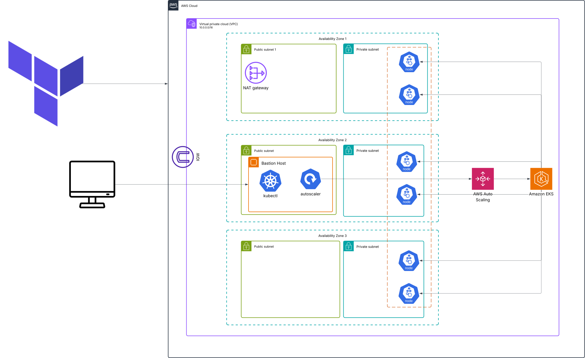

# 🚀 EKS Infrastructure with Terraform

<div align="center">


**Production-ready Amazon EKS cluster with complete infrastructure automation**

</div>

---

## 📋 Table of Contents

- [🏗️ Architecture Overview](#️-architecture-overview)
- [🧩 Components](#-components)
- [⚡ Prerequisites](#-prerequisites)
- [🚀 Deployment Steps](#-deployment-steps)
- [💡 Usage Examples](#-usage-examples)
- [🔒 Security Features](#-security-features)
- [📊 Monitoring & Troubleshooting](#-monitoring--troubleshooting)

---

## 🏗️ Architecture Overview

<div align="center">
  
</div>

This repository provides a **modular Terraform setup** for deploying a production-ready Amazon EKS cluster with comprehensive supporting infrastructure including VPC, IAM roles, and a secure bastion host for cluster management.

### 🎯 Key Features

<table>
<tr>
<td align="center">🌐<br><strong>Multi-AZ VPC</strong><br>High availability across zones</td>
<td align="center">🔐<br><strong>Secure Access</strong><br>Bastion host & IAM integration</td>
<td align="center">📈<br><strong>Auto Scaling</strong><br>Cluster autoscaler included</td>
<td align="center">⚙️<br><strong>Managed Addons</strong><br>CoreDNS, VPC-CNI, Kube-proxy</td>
</tr>
</table>

---

## 🧩 Components

### 1. 🌐 **VPC Module** (`modules/vpc/`)

<details>
<summary>Click to expand VPC details</summary>

- ✅ Creates VPC with public and private subnets across multiple AZs
- ✅ Sets up NAT Gateway for private subnet internet access  
- ✅ Configures proper tags for EKS integration
- ✅ Network ACLs and security groups

| Component | Purpose | Configuration |
|-----------|---------|---------------|
| Public Subnets | Load balancers, bastion host | `10.0.101.0/24`, `10.0.102.0/24`, `10.0.103.0/24` |
| Private Subnets | EKS worker nodes | `10.0.1.0/24`, `10.0.2.0/24`, `10.0.3.0/24` |
| NAT Gateway | Internet access for private subnets | One per AZ |

</details>

### 2. ☸️ **EKS Module** (`modules/eks/`)

<details>
<summary>Click to expand EKS details</summary>

- ✅ EKS cluster with managed node groups
- ✅ Essential cluster addons (CoreDNS, VPC-CNI, Kube-proxy, EKS Pod Identity Agent)
- ✅ Proper RBAC configuration for EKS manager
- ✅ Cluster autoscaler deployment template generation

#### 👥 IAM Roles & Users:
- **🔑 EKS Manager User**: IAM user with programmatic access for EKS management
- **🎭 EKS Manager Role**: IAM role that can be assumed by EC2 instances (bastion host)
- **🤖 Cluster Autoscaler IRSA Role**: Service account role for cluster autoscaler

</details>

### 3. 🖥️ **Bastion Host Module** (`modules/bastion/`)

<details>
<summary>Click to expand Bastion details</summary>

- ✅ EC2 instance in public subnet for secure cluster management
- ✅ Pre-configured with kubectl, AWS CLI, Helm
- ✅ EKS manager user credentials configured
- ✅ Ready-to-use environment for Kubernetes operations

</details>

---

## ⚡ Prerequisites

<div align="center">

| Requirement | Version | Status |
|-------------|---------|--------|
| 🔧 **AWS CLI** | Latest | ✅ Must be configured |
| 🏗️ **Terraform** | >= 1.0 | ✅ Required |
| 🔑 **SSH Key Pair** | - | ✅ Must exist in AWS |
| 🌐 **Public IP** | - | ✅ For security groups |

</div>

> 💡 **Tip**: Get your public IP with: `curl ifconfig.me`

---

## 🚀 Deployment Steps

### 1. 📥 Clone and Setup

```bash
git clone <your-repo>
cd eks-infrastructure
```

### 2. ⚙️ Configure Variables

Create or edit `terraform.tfvars`:

```hcl
# 🌍 Region and Cluster Configuration
aws_region   = "eu-north-1"
cluster_name = "myapp-eks-cluster"

# 🔒 Security Configuration (Replace with your actual IP)
endpoint_public_access_cidrs = ["YOUR_PUBLIC_IP/32"]  # Get with: curl ifconfig.me
bastion_allowed_cidrs       = ["YOUR_PUBLIC_IP/32"]

# 🔑 SSH Key Configuration
key_pair_name = "your-existing-key-pair"  # Must exist in AWS

# 🌐 Network Configuration
vpc_cidr_block             = "10.0.0.0/16"
private_subnet_cidr_blocks = ["10.0.1.0/24", "10.0.2.0/24", "10.0.3.0/24"]
public_subnet_cidr_blocks  = ["10.0.101.0/24", "10.0.102.0/24", "10.0.103.0/24"]

# 🏷️ Resource Tagging
common_tags = {
  Environment = "development"
  Project     = "myapp"
  ManagedBy   = "terraform"
  Owner       = "your-name"
}
```

### 3. 🔑 Create SSH Key Pair (if needed)

```bash
# Create key pair in AWS
aws ec2 create-key-pair \
  --key-name myapp-bastion-key \
  --query 'KeyMaterial' \
  --output text > ~/.ssh/myapp-bastion-key.pem

# Set proper permissions
chmod 400 ~/.ssh/myapp-bastion-key.pem

# Update terraform.tfvars with the key name
# key_pair_name = "myapp-bastion-key"
```

### 4. 🏗️ Deploy Infrastructure

```bash
# Initialize Terraform
terraform init

# Review the plan
terraform plan

# Deploy (takes ~15-20 minutes) ☕
terraform apply
```

<div align="center">

⏱️ **Estimated deployment time: 15-20 minutes**

</div>

### 5. 🎯 Access Your Infrastructure

```bash
# Get bastion host IP
terraform output bastion_public_ip

# SSH to bastion host
ssh -i ~/.ssh/your-key.pem ec2-user@$(terraform output -raw bastion_public_ip)

# Switch to EKS manager user on bastion
sudo su - eks-manager

# Test kubectl access ✅
kubectl get nodes
kubectl get pods --all-namespaces
```

### 6. 🤖 Deploy Cluster Autoscaler

On the bastion host as `eks-manager` user:

```bash
# Deploy cluster autoscaler
kubectl apply -f /home/eks-manager/cluster-autoscaler.yaml

# Check if it's running 🏃‍♂️
kubectl logs deployment/cluster-autoscaler -n kube-system
```

---

## 💡 Usage Examples

### 🖥️ Managing the Cluster from Bastion Host

```bash
# SSH to bastion
ssh -i ~/.ssh/your-key.pem ec2-user@BASTION_IP

# Switch to eks-manager user
sudo su - eks-manager

# Basic cluster operations
kubectl get nodes
kubectl get pods
kubectl get services
aws sts get-caller-identity

# Deploy a test application 🧪
kubectl create deployment nginx --image=nginx --replicas=3
kubectl expose deployment nginx --port=80 --type=LoadBalancer

# Scale to test autoscaler 📈
kubectl scale deployment nginx --replicas=10
```

### 💻 Managing from Your Local Machine

```bash
# Configure kubectl locally (if you have the right IP access)
aws eks update-kubeconfig --region eu-north-1 --name myapp-eks-cluster

# Test access ✅
kubectl get nodes
```

---

## 🔒 Security Features

<div align="center">

| Security Layer | Implementation | Status |
|----------------|----------------|--------|
| 🌐 **Network Isolation** | Private subnets for worker nodes | ✅ Implemented |
| 🚧 **Restricted Access** | EKS API only from specified IPs | ✅ Implemented |
| 🔐 **IAM Integration** | Proper RBAC using AWS IAM | ✅ Implemented |
| 🛡️ **Bastion Security** | SSH access from specified IPs only | ✅ Implemented |
| 🎭 **Service Accounts** | IRSA for pod-level AWS permissions | ✅ Implemented |

</div>

---

## 📊 Monitoring & Troubleshooting

### 🔍 Check Cluster Status

<details>
<summary>Click to expand troubleshooting commands</summary>

```bash
# Cluster information
aws eks describe-cluster --name myapp-eks-cluster

# Node groups status
aws eks describe-nodegroup \
  --cluster-name myapp-eks-cluster \
  --nodegroup-name main

# Cluster autoscaler logs
kubectl logs deployment/cluster-autoscaler -n kube-system

# Check all system pods
kubectl get pods -n kube-system

# Describe problematic pods
kubectl describe pod <pod-name> -n <namespace>

# Check cluster events
kubectl get events --sort-by=.metadata.creationTimestamp
```

</details>
